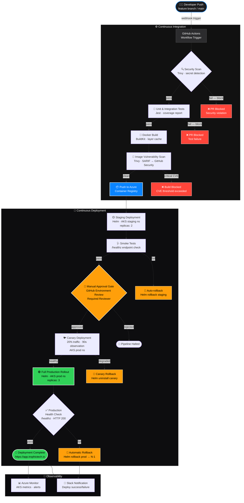

# Trophic Tech — CI/CD Pipeline Architecture

## End-to-End Flow: Code Push → AKS Production



## Pipeline Stage Summary

| Stage | Tool | SLA Target | Failure Mode |
|---|---|---|---|
| Security Scan | Trivy (fs) | < 2 min | Block PR |
| Lint | ESLint | < 1 min | Block PR |
| Unit Tests | Jest + Coverage | < 5 min | Block PR |
| Docker Build | BuildKit (cached) | < 3 min | Block build |
| Image Scan | Trivy (image) | < 2 min | Block push |
| Push to ACR | Docker push | < 2 min | Retry ×3 |
| Staging Deploy | Helm (atomic) | < 5 min | Auto-rollback |
| Smoke Test | curl /healthz | < 1 min | Auto-rollback |
| Approval Gate | GitHub Env Review | Manual | Halt pipeline |
| Canary (20%) | Helm + NGINX | 90s window | Rollback canary |
| Prod Deploy | Helm (atomic) | < 10 min | Auto-rollback |
| Health Check | curl /healthz | < 1 min | Helm rollback N-1 |

## Required GitHub Secrets

```
ACR_REGISTRY           # e.g. trophictech.azurecr.io
ACR_REPOSITORY         # e.g. app-name
ACR_USERNAME           # ACR service principal client ID
ACR_PASSWORD           # ACR service principal secret
AKS_CLUSTER            # AKS cluster name
AKS_RESOURCE_GROUP     # Azure resource group name
HELM_RELEASE           # Helm release name
AZURE_CREDENTIALS      # JSON blob from: az ad sp create-for-rbac
CODECOV_TOKEN          # Codecov upload token
SLACK_WEBHOOK_URL      # Slack incoming webhook
```

## GitHub Environment Configuration

Create three environments in **Settings → Environments**:

| Environment | Protection Rules |
|---|---|
| `staging` | No reviewers required |
| `production-approval` | Required reviewer(s) — acts as approval gate |
| `production` | No additional rules (guarded by approval-gate job dependency) |
