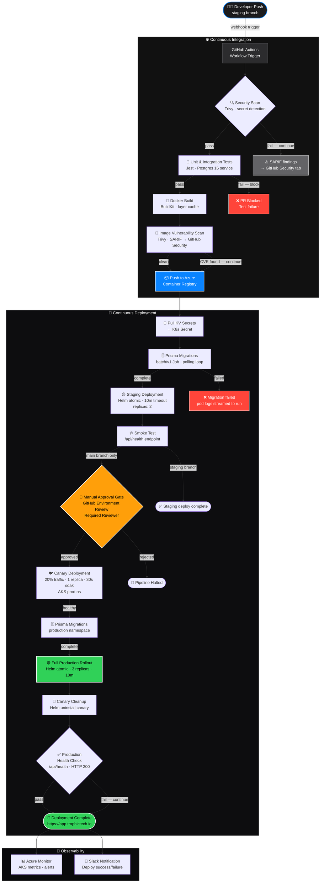

# Trophic Tech — CI/CD Pipeline Architecture

## Branch Strategy

```text
feature/* ──► staging (push) ──► Jobs 1–4  (Security → Tests → Build → Deploy Staging)
                                      │
                              PR merge to main
                                      │
                                      ▼
                       main (push) ──► Jobs 1–6 (+ Approval Gate → Deploy Production)
```

Pushing to `staging` runs the full CI suite and deploys to the staging namespace.
Merging a PR from `staging` → `main` triggers the complete pipeline through to production.

## End-to-End Flow: Code Push → AKS Production



## Pipeline Stage Summary

| Stage | Tool | SLA Target | On Failure |
| --- | --- | --- | --- |
| Security Scan | Trivy (fs) + ESLint | < 2 min | SARIF to Security tab (non-blocking) |
| Unit Tests | Jest + Postgres 16 | < 5 min | Block build |
| Docker Build | BuildKit (cached) | < 3 min | Block build |
| Image Scan | Trivy (image) | < 2 min | SARIF to Security tab (non-blocking) |
| Push to ACR | Docker push | < 2 min | Block pipeline |
| DB Migration (staging) | Prisma K8s Job | < 4 min | Fail with pod logs |
| Staging Deploy | Helm atomic | < 10 min | `--atomic` auto-rollback |
| Smoke Test | curl /api/health | < 1 min | Non-blocking (DNS/ingress optional) |
| Approval Gate | GitHub Env Review | Manual | Halt pipeline |
| PostgreSQL check | az postgres show | < 5 min | Fail if not Ready |
| DB Migration (prod) | Prisma K8s Job | < 4 min | Fail with pod logs |
| Canary (20%) | Helm + NGINX | 30 s soak | `--atomic` auto-rollback |
| Prod Deploy | Helm atomic | < 10 min | `--atomic` auto-rollback |
| Health Check | curl /api/health | < 1 min | Non-blocking (DNS/ingress optional) |
| Slack Notify | Slack webhook | < 10 s | Non-blocking |

## Required GitHub Secrets

```text
AZURE_CLIENT_ID          # OIDC federated identity client ID
AZURE_TENANT_ID          # Azure tenant ID
AZURE_SUBSCRIPTION_ID    # Azure subscription ID
ACR_REGISTRY             # e.g. trophictech.azurecr.io
ACR_REPOSITORY           # e.g. mission-control
AKS_CLUSTER              # AKS cluster name
AKS_RESOURCE_GROUP       # Resource group containing the AKS cluster
HELM_RELEASE             # Helm release base name — e.g. trophic-app
SLACK_WEBHOOK_URL         # Slack incoming webhook
CODECOV_TOKEN            # Codecov upload token
```

> Authentication uses OIDC — no `ACR_PASSWORD` or `AZURE_CREDENTIALS` blob needed.
> Key Vault names (`trophic-staging-kv` / `trophic-prod-kv`) are provisioned by Terraform
> and hardcoded in the workflow — they are not GitHub secrets.

## GitHub Environment Configuration

Create three environments in **Settings → Environments**:

| Environment | Protection Rules |
| --- | --- |
| `staging` | None required |
| `production-approval` | Required reviewer(s) — acts as approval gate |
| `production` | None (guarded by `approval-gate` job dependency) |
